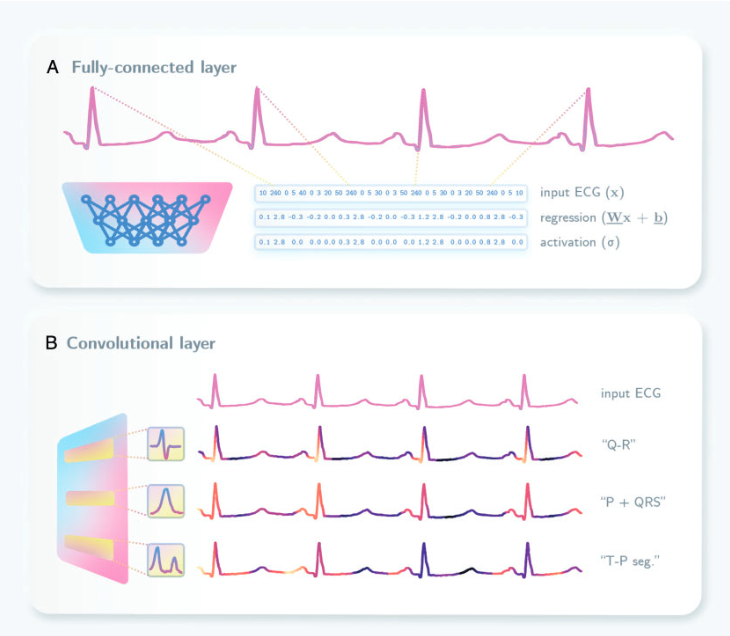
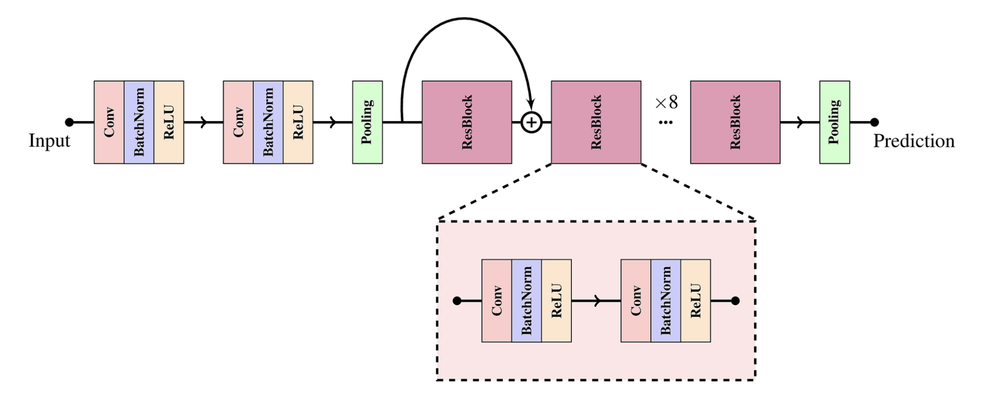
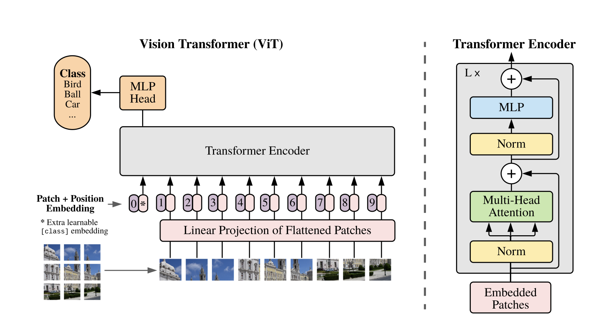

[comment]: # "This is the standard layout for the project, but you can clean this and use your own template"

# Comprehensive ECG analysis with Deep Learning

#### Team

- E/17/006, Alahakoon A.M.H.H, [email](mailto:e17006@eng.pdn.ac.lk)
- E/17/242, Perera C.R.M, [email](mailto:e17242@eng.pdn.ac.lk)
- E/17/338, Srimal R.M.L.C, [email](mailto:e17338@eng.pdn.ac.lk)

#### Supervisors

- Dr. Isuru Nawinne, [email](mailto:isurunawinne@eng.pdn.ac.lk)
- Dr. Mahanama Wickramasinghe, [email](mailto:mahanamaw@eng.pdn.ac.lk)
- Prof. Roshan Ragel, [email](mailto:roshanr@eng.pdn.ac.lk)
- Dr. Vajira Thambawita, [email](mailto:vajira@simula.no) 

#### Table of content

1. [Abstract](#abstract)
2. [Related works](#related-works)
3. [Methodology](#methodology)
4. [Experiment Setup and Implementation](#experiment-setup-and-implementation)
5. [Results and Analysis](#results-and-analysis)
6. [Conclusion](#conclusion)
7. [Publications](#publications)
8. [Links](#links)

---

## Abstract
Electrocardiogram (ECG) is the most widely used and accessible medical test conducted in the world. Accurate prediction of ECG parameters (HR, QRS, QT, and PR) using deep learning and developing an open source platform in place of expensive traditional systems such as the MUSE system, will expand the scope of ECG analysis to a broader audience in research. This paper proposes a ResNet and an enhanced Vision transformer, which predicts the Heart Rate, QRS, QT, and PR intervals of the ECG signal. The models are initially trained on a large deepfake ECG dataset and subsequently fine-tuned on the PTBXL dataset to establish their performance against a benchmark dataset and enhance generalizability. This transfer learning approach eliminates the problem of having huge datasets to train CNNs and Transformers for ECG analysis.

*Index Terms*—Electrocardiogram, Deep Learning, ResNet, Vi-sion Transformer, Transfer Learning, Cardiovascular medicine

## Related works

### *Deep learning in ECG analysis*
Deep learning has emerged as a powerful technique in various fields, especially in biomedical research and healthcare in this era of AI. Deep learning is a specialized architecture that aims to capture patterns within data to build effective models. In particular, deep learning diverges from traditional machine learning in a significant aspect. Unlike traditional approaches that require feature engineering, where domain knowledge is applied to extract relevant features from raw data, deep learning algorithms possess the capacity to automatically extract information and discern patterns solely from raw data. Therefore Deep Learning demonstrates remarkable capabilities in identifying abnormal heart rhythms and mechanical dysfunction, thus holding a significant potential to aid healthcare decisions. By leveraging the inherent capacity of deep learning to extract intricate patterns and relationships from ECG data, these algorithms offer an opportunity to enhance the accuracy and efficiency of cardiac diagnostics.

Traditionally, the analysis of ECGs focused on classifying heartbeats and identifying the different segments (P-QRS-T), the parameters that cardiologists use to identify heart-related diseases. These tasks were initially accomplished using signal processing techniques. By applying methods such as Fourier transformation, Hermite techniques, and wavelet transformations, the ECG represented as a time series with signal intensity was decomposed into wavelike components. However, machine learning and deep learning models have consistently demonstrated superior performance, offering the potential for improved generalization capabilities.

In the field of deep learning and ECG analysis, various deep learning architectures have been used to extract valuable insights from complex and dynamic ECG signals. The following paragraphs hope to explain some of the promising deep learning architectures so far used in this field of research.

The figure visualizes how Convolutional Neural networks identify the crucial intervals in the ECG signal.

There is a particular deep-learning architecture that stands out from the rest. That is convolutional neural network architecture. This is widely used in computer vision although its impact is high in the domain of ECG analysis as well. Convolution refers to the act of taking a small pattern (the so-called 'kernel') and identifying where in the input that pattern arises, similar to a sliding window. The resulting heat map of activity helps to identify where such patterns exist in the image (or the signal in ECG analysis), which can then be used to localize important features, retain global information through successive layers, and remove artifacts deemed unnecessary by the neural network during training. For example, one of the simplest convolutional kernels functions as an edge detector by detecting horizontal or vertical changes in a signal. Serial combinations in parallel and series of these simple edge detectors can allow the CNN to learn how edges combine to form more complex shapes. This same principle is relevant when using CNNs for ECG signals. The CNN can identify the necessary intervals through convolutional kernels thus giving a higher accuracy when predicting the ECG parameters. 

Transformers is another recent and popular deep learning architecture that is being widely used in natural language processing tasks. The self-attention mechanism of transformers allows the consideration of the entire sequence of an ECG signal, rather than a kernel or a sliding window potentially capturing complex temporal relationships that other architectures might miss. The self-attention mechanism is a key innovation of the Transformer model. This mechanism helps the model assess and prioritize different elements within the input sequence, capturing relationships between these elements independent of their sequential positions. This attention mechanism has proven successful across various domains, including computer vision and large language models, by enabling the model to highlight important features. Increasingly, researchers have used and adapted the self-attention transformer for ECG applications, achieving promising results.

Although Transformer based ECG analysis is a growing research area, there is a huge obstacle of data scarcity that eventually hinders the progression of using Transformers for ECG analysis. This factor is also true for CNNs as well. This paper clearly demonstrates that data scarcity issues can be overcome by training on a deepfake dataset and then finetuning on a real smaller dataset.

### *Transfer learning*
Transfer learning is the improvement of learning in a new task through the transfer of knowledge from a related task that has already been learned. According to the surveys conducted for transfer learning, the methods of transfer learning are classified into three main categories with the relationship between the source domain and the target domain. However, in the deep learning domain, deep transfer learning is categorized as instances-based deep transfer learning, mapping-based deep transfer learning, network-based deep transfer learning, and adversarial-based deep transfer learning according to the techniques used in deep transfer learning.

The deep transfer learning approach taken for this study is network-based transfer learning. Network-based transfer learning can be viewed as the re-usage of the partial network that is pre-trained in the source domain, including its network structure and connection parameters, and transfer it to be a part of a deep neural network used in the target domain.

## Methodology

### *Datasets*
The datasets used in this study are DeepFake, PTB-XL, and PTB-XL+. The DeepFake dataset has been generated using generative adversarial networks (GANs). It consists of properly generated realistic synthetic ECGs with 8-lead values [lead names from first coloumn to eighth column: 'I','II','V1','V2','V3','V4','V5','V6'] for 10s (5000 values per lead). These 8-leads format can be converted to 12-leads format using the following equations.

lead III value = (lead II value) - (lead I value)

lead aVR value = -0.5*(lead I value + lead II value)

lead aVL value = lead I value - 0.5 * lead II value

lead aVF value = lead II value - 0.5 * lead I value

There are two versions of the DeepFake dataset namely the large dataset and the small dataset. The DeepFake large dataset has already been split into three splits train, test, and validation. There are 97581 train data, 12198 test data, and 12198 validation data in the DeepFake large dataset. The DeepFake small dataset has also been split into three splits train, test, and validation. There are 10000 train data, 2500 test data, and 2500 validation data in the DeepFake small dataset. Other than DeepFake, the PTB-XL dataset was also used as a benchmark dataset in this study. The PTB-XL ECG dataset is a large dataset of 21799 clinical 12-lead ECGs from 18869 patients of 10-second length. The whole PTB-XL dataset was split into tree splits as 80% for train, 10% for test, and 10% for validation. Also, the PTB-XL ECGs were converted to 8-lead ECGs by removing the leads III, aVR, aVL, and aVF in order to compare the results with the DeepFake dataset. However, this PTB-XL dataset lacks important metadata such as ECG features. Therefore, the PTB-XL+ dataset was used as a supplementary dataset. The PTB-XL+ dataset is a comprehensive feature dataset that supplements the PTB-XL ECG dataset. It includes ECG features extracted via two commercial and one open-source algorithm in a harmonized format as well as median beats or, where applicable, fiducial points extracted by the respective algorithms. This supplementary dataset will decisively improve the usability of the PTB-XL dataset in order to turn it into a reference dataset for machine learning methods related to ECG data. In this study, only normal ECGs were considered from both DeepFake and PTB-XL datasets.

### *Model Architecture*
The proposed method of deep transfer learning was tested against 2 deep learning models namely a residual convolutional neural network (ResNet) and a variation of the Vision Transformer (ViT). Both models receive eight lead ECG signals as input and predict the Heart Rate, PR interval, QT interval, and QRS complex of the corresponding ECG. Predicting these important ECG parameters produces a sophisticated ECG analysis similar to the MUSE system which extends the future research on ECG analysis and clinical decision making. The following sections of the paper aim to explain the architectures of the ResNet and the Vision transformer.

#### *ResNet*
A notable CNN architecture was proposed in the paper "Explaining deep neural networks for knowledge discovery in electrocardiogram analysis". In this paper, the authors propose a novel deep learning model, with the architecture of a standard CNN consisting of eight residual models (ResNet) to capture complex features and relationships in the standard ECG signal. 

The input ECG signal is initially processed by two convolutional layers, each generating feature maps of 64 and 32, respectively, using kernel sizes of 8 and 3. The output of these convolutional layers is then subjected to average pooling. Subsequently, the processed signal is passed through eight residual blocks, each comprising two convolutional layers. Both convolutional layers within each residual block generate feature maps of 64 and 32, utilizing kernel sizes of 3. Figure demonstrates the architecture of this Residual Network.

#### *Vision Transformer*
This model was built from the inspiration of the paper "An image is worth 16x16 words: Transformers for image recognition at scale". Transformers in particular have promising results in ECG classifying tasks. This work proposes a novel version of the vision transformer specifically built for ECG analysis. 

In the original Vision Transformer, an image is divided into 16*16 (224) patches and encoded with patch embeddings for multi-head attention. This approach was used similarly in the vision transformer for the ECG analysis. An ECG signal of 500Hz 10s and 8 leads has 5000 data points and 8 channels. This tensor is divided into 100 patches and then passed along to the multi-head attention units along with patch embeddings. Figure demonstrates the overall architecture of this Vision Transformer for ECG analysis.

Transformers inherently need a huge amount of data to achieve better results. Therefore, training the transformer for better accuracy through deepfake data and fine-tuning from a smaller real-world dataset was a crucial factor to consider.

## Experiment Setup and Implementation

### *Training*
All models were trained and experimented using the 7th generation Intel Core i9-13900K CPU on a Linux operating system (Ubuntu 22.04) with 32 GB (2x16 GB) DDR5-6000 Memory. NVIDIA GeForce RTX 3090 Ti graphical processing unit with 24 GB VRAM is employed for model training and inferencing. The model is developed by Pytorch framework in Python programming language.

### *Experiments*
For the model evaluation of the Fully Connected Neural Network, Residual Neural Network (ResNet), and Transformer Network, seven experiments were conducted to measure standard, clinically relevant intervals. The predicted intervals include the PR interval, QRS duration, heart rate, and QT interval.

1. Baseline model evaluation

    The fully connected neural network was evaluated with the small-deepfake dataset. The results from this experiment were considered as the benchmark results, and compared with the performances of other complex models.

2. Resnet model evaluation with the deepfake dataset

    The residual neural network was evaluated with the small-deepfake dataset. After that, the minimum validation losses of each parameter prediction (mean absolute error) were compared with the results from the fully connected neural network to measure the performance of the model.

3. Resnet model evaluation with the PTB-XL dataset

    Since the residual neural network performed significantly well compared to the baseline model, it was also evaluated with the PTB-XL dataset. In this experiment, the data processing pipeline was enhanced by adding new features such as a learning rate schedular, early stopping, and checkpoint saving mechanism.

4. Resnet model evaluation with transfer learning

    Transfer learning is used to improve the performance of the residual neural network with the ptb-xl dataset. In this experiment, the model was saved at the checkpoint where it performs well for predicting ecg parameters with the deepfake dataset. After that, the saved model was retrained, and evaluated with the ptb-xl dataset.

5. Transformer model evaluation with the deepfake dataset

    In a similar way to the residual neural network, The transformer network (ViT) was evaluated with the small-deepfake dataset.

6. Transformer model evaluation with the PTB-XL dataset

    In a similar way to the residual neural network, The transformer network (ViT) was evaluated with the PTB-XL dataset.

7. Transformer model evaluation with transfer learning

    In a similar way to the residual neural network, The transformer network (ViT) was evaluated with the PTB-XL dataset with transfer learning.

## Results and Analysis

This section presents the result obtained by conducting seven experiments for measuring standard, clinically relevant intervals for the model evaluation of the Fully Connected Neural Network, Residual Neural Network (ResNet), and Transformer Network.

**Fully Connected Neural Network Results.** A Fully-Connected Neural Network is used as the baseline model for the research. The performance of our method for predicting ECG intervals is evaluated using quantitative regression metrics. The primary metric used for evaluation is the mean absolute error (MAE). Table I shows the validation loss for each parameter with the deepfake-small dataset.

| Parameter | Validation Loss (MAE) |
| :---: | :---: |
| Heart Rate | 55.82 |
| PR Interval | 461.05 |
| QRS Duration | 76.80 |
| QT Interval | 1661.98 |

**TABLE I: Validation Loss of Fully Connected Neural Network**

**Residual Network Results.** Since the result of the fully connected neural network was not as expected, another set of experiments was conducted with the Residual Neural Network (ResNet). Table II shows the validation loss for each parameter with the two datasets deepfake-small and pt-xl.

Parameter | Validation Loss With Small-Deepfake dataset | Validation Loss With PTB-XL dataset
:---: | :---: | :---:
Heart Rate | 0.08 | 0.10
PR Interval | 5.35 | 34.58
QRS Duration | 3.36 | 6.03
QT Interval | 3.94 | 40.55

**TABLE II: Validation Losses of Residual Neural Network**

The results with ptb-xl weren't as good as the deepfake dataset, Especially PR and QT intervals have significant differences. Therefore, another set of experiments were conducted to predict the parameters using transfer learning. Table III shows the improvement of the validation losses for each parameter after transfer learning.

Parameter | Validation Loss With PTB-XL dataset Before transfer learning | Validation Loss With PTB-XL dataset After transfer learning
:---: | :---: | :---:
Heart Rate | 0.10 | 0.05
PR Interval | 34.58 | 11.80
QRS Duration | 6.03 | 2.80
QT Interval | 40.55 | 16.32

**TABLE III: The impact of transfer learning**

**Transformer Results.** Similar experiments were conducted for the Transformer Network (ViT) as the Residual Neural Network (ResNet). Table IV shows the validation loss for each parameter with the two datasets deepfake-small and pt-xl.

Parameter | Validation Loss With Small-Deepfake dataset | Validation Loss With PTB-XL dataset
:---: | :---: | :---:
Heart Rate | 1.80 | 18.12
PR Interval | 162.00 | 233.50
QRS Duration | 47.73 | 50.63
QT Interval | 246.70 | 204.60

**TABLE IV: Validation Losses of Transformer Network**

Table V shows the summary of validation Losses (MAE). The residual neural network gives the best result among all the models. For the ptb-xl dataset, the results were able to improve using transfer learning.

Parameter | With Deepfake dataset Fully Connected NN | With Deepfake dataset Residual Nueral Network | With Deepfake dataset Transformer Network | With PTB-XL dataset Residual Neural Network | With PTB-XL dataset Trasnformer Network | With PTB-XL dataset Transfer Learned ResNet | With PTB-XL dataset Transfer learned Transformer 
:---: | :---: | :---: | :---: | :---: | :---: | :---: | :---: 
Heart Rate | 55.82 | 0.08 | 1.80 | 0.10 | 18.12 | 0.05 | 10.88 
PR Interval | 461.05 | 5.35 | 162.00 | 34.58 | 233.50 | 11.80 | 63.78
QRS Duration | 76.80 | 3.36 | 47.73 | 6.03 | 50.63 | 2.80 | 28.02 
QT Interval | 1661.98 | 3.94 | 246.7 | 40.55 | 204.60 | 16.32 | 78.55 

**TABLE V: The summary of validation losses (MAE)**

## Conclusion
This work focused on achieving an ECG analysis similar to MUSE system using deep transfer learning on synthetic ECG signals. Table V, clearly demonstrates that transfer learning significantly impacted to decrease the validation losses in ECG parameters. Therefore it can be concluded that, CNN and Transformer model parameters which need a huge amount of training data can be trained through a larger synthetic dataset and can be generalized to real world data by fine tuning. This eliminates the requirement for larger datasets which is very challenging when considering sensitive data like ECG signals.

It can be also pointed out that, through the MUSE like comprehensive analysis of ECG signals from an open source platform, further enhances the accessibility and collaboration of ECG research. This work can be further extended to develop a robust and open source alternative to MUSE system.

## Publications
[//]: # "Note: Uncomment each once you uploaded the files to the repository"

<!-- 1. [Semester 7 report](./) -->
<!-- 2. [Semester 7 slides](./) -->
<!-- 3. [Semester 8 report](./) -->
<!-- 4. [Semester 8 slides](./) -->
<!-- 5. Author 1, Author 2 and Author 3 "Research paper title" (2021). [PDF](./). -->

## Links

[//]: # ( NOTE: EDIT THIS LINKS WITH YOUR REPO DETAILS )

- [Project Repository](https://github.com/cepdnaclk/e17-4yp-Comprehensive-ECG-analysis-with-Deep-Learning-on-GPU-accelerators)
- [Project Page](https://cepdnaclk.github.io/e17-4yp-Comprehensive-ECG-analysis-with-Deep-Learning-on-GPU-accelerators)
- [Department of Computer Engineering](http://www.ce.pdn.ac.lk/)
- [University of Peradeniya](https://eng.pdn.ac.lk/)

[//]: # "Please refer this to learn more about Markdown syntax"
[//]: # "https://github.com/adam-p/markdown-here/wiki/Markdown-Cheatsheet"
