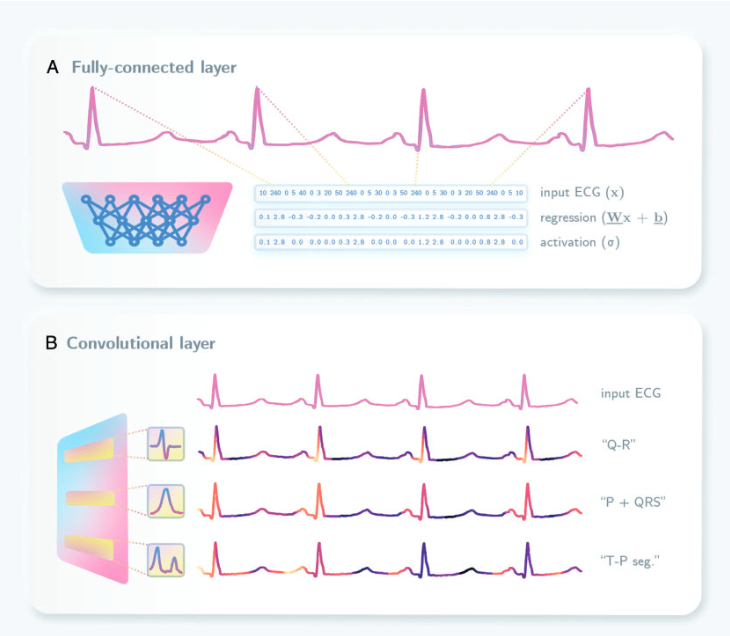
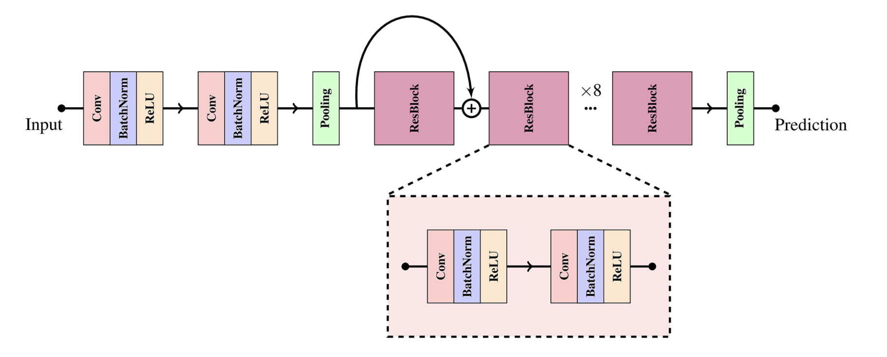
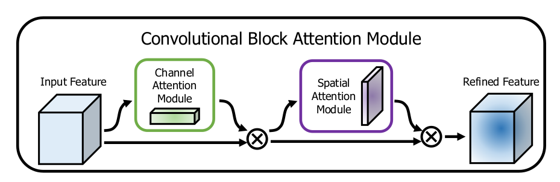
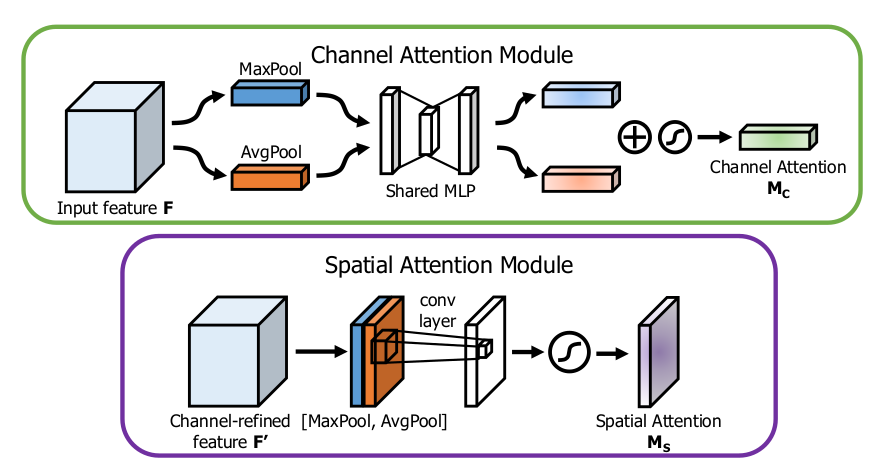
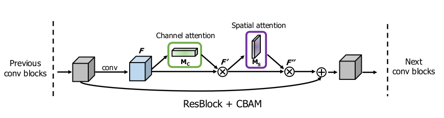
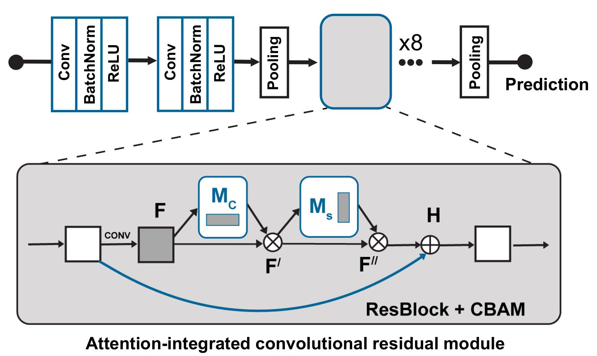
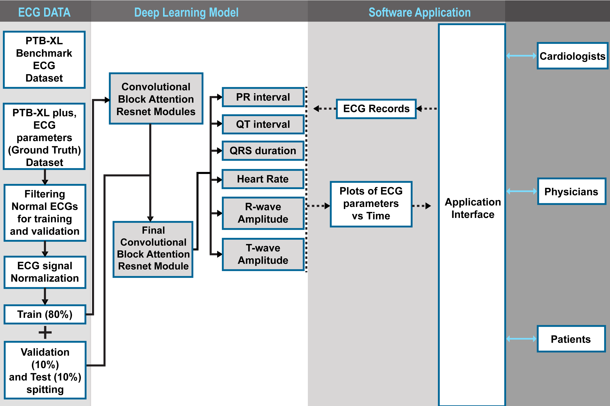

# AICRN: Attention-Integrated Convolutional Residual Network for Interpretable ECG Analysis

## Abstract

Electrocardiogram (ECG) is the most widely used and accessible medical test conducted in the world. Accurate prediction of ECG parameters (HR, QRS, QT, and PR) using deep learning and developing an open source platform in place of expensive traditional systems such as the MUSE system, will expand the scope of ECG analysis to a broader audience in research. This research introduces a novel deep learning architecture named Attention-Integrated Convolutional Residual Network (AICRN), explicitly designed to improve the precision and interpretability of Electrocardiogram (ECG) parameter regression. AICRN leverages convolutional residual networks augmented with spatial and channel attention mechanisms to dynamically identify critical features of ECG signals, significantly enhancing diagnostic accuracy. The proposed method effectively automates the regression of essential ECG parameters, including PR interval, QT interval, QRS duration, heart rate, and the peak amplitudes of R and T waves, outperforming existing state-of-the-art methods.

*Index Terms*— Electrocardiogram, Deep Learning, Residual Networks, Attention Mechanisms, Cardiovascular Diagnostics

## Related works

### *Deep learning in ECG analysis*
Deep learning has emerged as a powerful technique in various fields, especially in biomedical research and healthcare in this era of AI. Deep learning is a specialized architecture that aims to capture patterns within data to build effective models. In particular, deep learning diverges from traditional machine learning in a significant aspect. Unlike traditional approaches that require feature engineering, where domain knowledge is applied to extract relevant features from raw data, deep learning algorithms possess the capacity to automatically extract information and discern patterns solely from raw data. Therefore Deep Learning demonstrates remarkable capabilities in identifying abnormal heart rhythms and mechanical dysfunction, thus holding a significant potential to aid healthcare decisions. By leveraging the inherent capacity of deep learning to extract intricate patterns and relationships from ECG data, these algorithms offer an opportunity to enhance the accuracy and efficiency of cardiac diagnostics.

Traditionally, the analysis of ECGs focused on classifying heartbeats and identifying the different segments (P-QRS-T), the parameters that cardiologists use to identify heart-related diseases. These tasks were initially accomplished using signal processing techniques. By applying methods such as Fourier transformation, Hermite techniques, and wavelet transformations, the ECG represented as a time series with signal intensity was decomposed into wavelike components. However, machine learning and deep learning models have consistently demonstrated superior performance, offering the potential for improved generalization capabilities.

In the field of deep learning and ECG analysis, various deep learning architectures have been used to extract valuable insights from complex and dynamic ECG signals. The following paragraphs hope to explain some of the promising deep learning architectures so far used in this field of research.

The figure visualizes how Convolutional Neural networks identify the crucial intervals in the ECG signal.

There is a particular deep-learning architecture that stands out from the rest. That is convolutional neural network architecture. This is widely used in computer vision although its impact is high in the domain of ECG analysis as well. Convolution refers to the act of taking a small pattern (the so-called 'kernel') and identifying where in the input that pattern arises, similar to a sliding window. The resulting heat map of activity helps to identify where such patterns exist in the image (or the signal in ECG analysis), which can then be used to localize important features, retain global information through successive layers, and remove artifacts deemed unnecessary by the neural network during training. For example, one of the simplest convolutional kernels functions as an edge detector by detecting horizontal or vertical changes in a signal. Serial combinations in parallel and series of these simple edge detectors can allow the CNN to learn how edges combine to form more complex shapes. This same principle is relevant when using CNNs for ECG signals. The CNN can identify the necessary intervals through convolutional kernels thus giving a higher accuracy when predicting the ECG parameters. 

Transformers is another recent and popular deep learning architecture that is being widely used in natural language processing tasks. The self-attention mechanism of transformers allows the consideration of the entire sequence of an ECG signal, rather than a kernel or a sliding window potentially capturing complex temporal relationships that other architectures might miss. The self-attention mechanism is a key innovation of the Transformer model. This mechanism helps the model assess and prioritize different elements within the input sequence, capturing relationships between these elements independent of their sequential positions. This attention mechanism has proven successful across various domains, including computer vision and large language models, by enabling the model to highlight important features. Increasingly, researchers have used and adapted the self-attention transformer for ECG applications, achieving promising results.

Although Transformer based ECG analysis is a growing research area, there is a huge obstacle of data scarcity that eventually hinders the progression of using Transformers for ECG analysis. This factor is also true for CNNs as well.

---

## Background and Motivation

ECG analysis is integral to cardiac diagnostics, traditionally requiring extensive manual effort, resulting in variability and errors. Advancements in deep learning have shifted ECG analysis towards automated, accurate, and interpretable diagnostics, significantly impacting clinical decision-making.

---

## Dataset

The PTB-XL dataset, featuring 21,799 clinical 12-lead ECG recordings from 18,869 patients, serves as the primary benchmark. Data preprocessing included normalization, removal of non-essential leads, and meticulous splitting into training, validation, and testing subsets.

---

## Methodology

#### *ResNet*
A notable CNN architecture was proposed in the paper "Explaining deep neural networks for knowledge discovery in electrocardiogram analysis". In this paper, the authors propose a novel deep learning model, with the architecture of a standard CNN consisting of eight residual models (ResNet) to capture complex features and relationships in the standard ECG signal. 

The input ECG signal is initially processed by two convolutional layers, each generating feature maps of 64 and 32, respectively, using kernel sizes of 8 and 3. The output of these convolutional layers is then subjected to average pooling. Subsequently, the processed signal is passed through eight attention integrated residual blocks. 

### Convolutional Block Attention Module (CBAM)

CBAM sequentially employs Channel Attention Module (CAM) and Spatial Attention Module (SAM) to emphasize relevant features. CAM identifies important features using global pooling and a shared MLP, while SAM spatially locates these critical features through convolutional operations.

### Attention-Integrated Convolutional Residual Network (AICRN)

AICRN integrates convolutional residual blocks to address gradient vanishing issues inherent in deep networks and enhances model precision through channel and spatial attention mechanisms (Convolutional Block Attention Module - CBAM).

#### Key Architectural Components

* **Residual Blocks:** Enhance model depth without gradient instability.
* **Attention Modules (CBAM):** Dynamically emphasize critical ECG signal features through spatial and channel-specific attention.

---

#### Deep Learning Architecture

---

### Model Training

* **Optimizer:** NAdam (Learning Rate: 0.0005)
* **Batch Size:** 300
* **Epochs:** 1000 (early stopping enabled)
* **Metrics:** Mean Absolute Error (MAE), Root Mean Square Error (RMSE), R² score

---

## Results

Extensive evaluation demonstrated AICRN's superior performance, notably achieving lower Mean Absolute Error (MAE) compared to leading existing models:

| Parameter        | AICRN MAE |
| ---------------- | --------- |
| Heart Rate       | 0.428 bpm |
| PR Interval      | 4.62 ms   |
| QRS Duration     | 2.008 ms  |
| QT Interval      | 4.583 ms  |
| R Wave Amplitude | 0.027 mV  |
| T Wave Amplitude | 0.028 mV  |

### Ablation Study

Attention mechanisms significantly improved performance metrics across all ECG parameters, validating their integral role in deep ECG analysis. The performance of the models for 5 runs is depicted in the table below.

| Parameter             | RMSE with Attention | RMSE without Attention | R² with Attention | R² without Attention |
| --------------------- | ------------------- | ---------------------- | ----------------- | -------------------- |
| PR Interval (ms)      | 5.047 ± 0.687       | 5.343 ± 0.286          | 0.964 ± 0.010     | 0.941 ± 0.008        |
| QT Interval (ms)      | 4.614 ± 0.288       | 5.108 ± 0.378          | 0.976 ± 0.001     | 0.970 ± 0.004        |
| QRS Duration (ms)     | 2.379 ± 0.267       | 2.846 ± 0.219          | 0.936 ± 0.011     | 0.900 ± 0.015        |
| Heart Rate (bpm)      | 0.473 ± 0.043       | 0.606 ± 0.122          | 0.998 ± 0.0001    | 0.997 ± 0.0009       |
| R Wave Amplitude (mV) | 0.044 ± 0.004       | 0.053 ± 0.002          | 0.989 ± 0.003     | 0.985 ± 0.002        |
| T Wave Amplitude (mV) | 0.031 ± 0.004       | 0.032 ± 0.001          | 0.961 ± 0.005     | 0.951 ± 0.002        |

---

## Application and Impact

The developed AICRN-based software facilitates automated, real-time monitoring and analysis of ECG parameters, drastically reducing manual interpretation time and errors. This tool is suitable for diverse clinical environments, supporting cardiologists, physicians, and patient self-monitoring.

---

## Resources

The trained models, comprehensive source code, and data preprocessing scripts are provided open-source, enabling replication, extension, and practical deployment by the research community:

* [GitHub Repository](https://github.com/cepdnaclk/e17-4yp-Comprehensive-ECG-analysis-with-Deep-Learning-on-GPU-accelerators)
* [Project Page](https://cepdnaclk.github.io/e17-4yp-Comprehensive-ECG-analysis-with-Deep-Learning-on-GPU-accelerators)

---

## Team

* **J.M.I.H. Jayakody** ([e18149@eng.pdn.ac.lk](mailto:e18149@eng.pdn.ac.lk))
* **A.M.H.H. Alahakoon** ([e17006@eng.pdn.ac.lk](mailto:e17006@eng.pdn.ac.lk))
* **C.R.M. Perera** ([e17242@eng.pdn.ac.lk](mailto:e17242@eng.pdn.ac.lk))
* **R.M.L.C. Srimal** ([e17338@eng.pdn.ac.lk](mailto:e17338@eng.pdn.ac.lk))

## Supervisors

* **Prof. Roshan Ragel** ([roshanr@eng.pdn.ac.lk](mailto:roshanr@eng.pdn.ac.lk))
* **Dr. Vajira Thambawita** ([vajira@simula.no](mailto:vajira@simula.no))
* **Dr. Isuru Nawinne** ([isurunawinne@eng.pdn.ac.lk](mailto:isurunawinne@eng.pdn.ac.lk))
* **Dr. Mahanama Wickramasinghe** ([mahanamaw@eng.pdn.ac.lk](mailto:mahanamaw@eng.pdn.ac.lk))

---

- [Project Repository](https://github.com/cepdnaclk/e17-4yp-Comprehensive-ECG-analysis-with-Deep-Learning-on-GPU-accelerators)
- [Project Page](https://cepdnaclk.github.io/e17-4yp-Comprehensive-ECG-analysis-with-Deep-Learning-on-GPU-accelerators)
- [Department of Computer Engineering](http://www.ce.pdn.ac.lk/)
- [University of Peradeniya](https://eng.pdn.ac.lk/)

[//]: # "Please refer this to learn more about Markdown syntax"
[//]: # "https://github.com/adam-p/markdown-here/wiki/Markdown-Cheatsheet"
